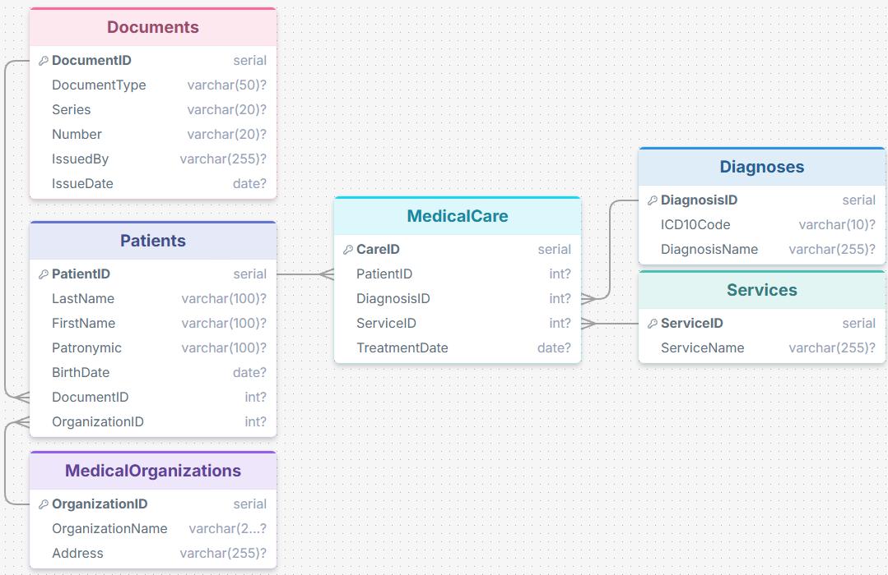
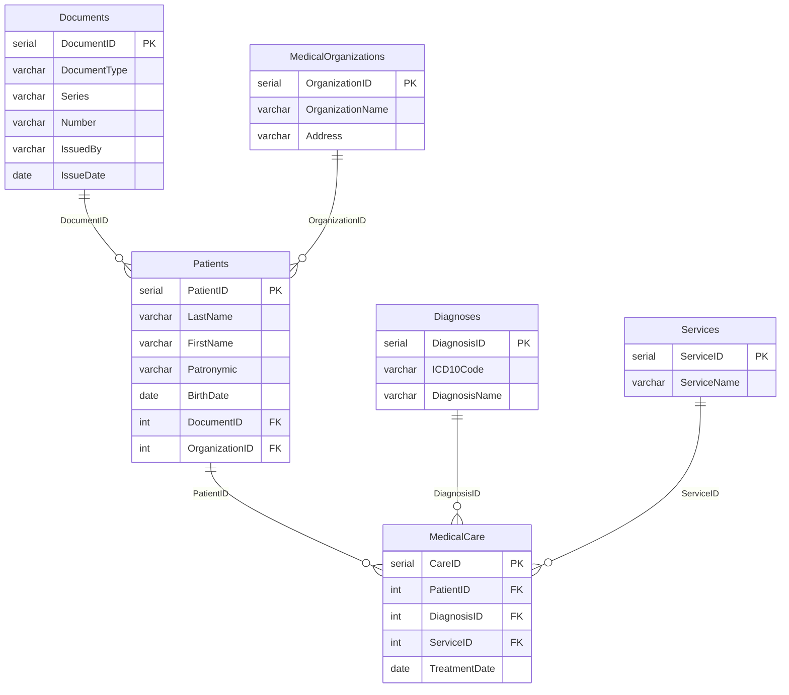

# MedicalDB — база данных медицинской организации

[](https://www.postgresql.org/)
[](CREATE%20TABLES.sql)

Учебный проект реляционной базы данных для учёта пациентов, документов, медицинских организаций, диагнозов (МКБ-10), услуг и оказанной медицинской помощи.

> [!NOTE]
> Все данные вымышлены любые совпадения случайны. Кроме МКБ10(IDC10), они взяты с сайта [mkb-10.com](https://mkb-10.com/index.php).

## Схема базы данных

### Символьная

<!-- Рисовал сам вручную -->
```text
    ┌──────────────────────┐
    │      Documents       │
    ├──────────────────────┤
┌──►| PK DocumentID        │
|   │ DocumentType         │
|   │ Series               │
|   │ Number               │
|   │ IssuedBy             │
|   │ IssueDate            │
|   └──────────────────────┘                              ┌──────────────────────┐  
|                               ┌──────────────────────┐  │      Diagnoses       │  
|   ┌──────────────────────┐    │     MedicalCare      │  ├──────────────────────┤  
|   │       Patients       │    ├──────────────────────┤┌►│ PK DiagnosisID       │
|   ├──────────────────────┤    │ PK CareID            │| │ ICD10Code            │
|   │ PK PatientID         │◄───│ FK PatientID         │| │ DiagnosisName        │
|   │ LastName             │    │ FK DiagnosisID       │┘ └──────────────────────┘
|   │ FirstName            │    │ FK ServiceID         │┐
|   │ Patronymic           │    │ TreatmentDate        │| ┌──────────────────────┐  
|   │ BirthDate            │    └──────────────────────┘| │      Services        │  
└───│ FK DocumentID        │                            | ├──────────────────────┤  
┌───│ FK OrganizationID    │                            └►│ PK ServiceID         │
|   └──────────────────────┘                              │ ServiceName          │
|                                                         └──────────────────────┘
|   ┌──────────────────────┐
|   │ MedicalOrganizations │
|   ├──────────────────────┤
└──►│ PK OrganizationID    │
    │ OrganizationName     │
    │ Address              │
    └──────────────────────┘
```

### drawsql



### ER-диаграмма



## Описание

База данных **MedicalDB** моделирует типичный сценарий медицинской информационной системы:

| Сущность         | Назначение                                                                                 |
|--------------------------|------------------------------------------------------------------------------------------------------|
| **Documents**            | Удостоверяющие документы пациентов (паспорт и т.п.)        |
| **MedicalOrganizations** | ЛПУ, к которым прикреплён пациент                                        |
| **Patients**             | Персональные данные пациентов                                             |
| **Diagnoses**            | Справочник диагнозов по коду МКБ-10                                      |
| **Services**             | Справочник медицинских услуг                                               |
| **MedicalCare**          | Факты оказания помощи (пациент + диагноз + услуга + дата) |

В репозитории есть [DDL](https://ru.wikipedia.org/wiki/Data_Definition_Language) для создания таблиц, внешних ключей и тестовые данные для проверки запросов.

## Структура проекта

```
CREATE TABLES.sql - Запрос для создания таблиц и вставки тестовых данных
query.sql - Запрос который удовлетворяет определенным условиям
```

## Как запустить

### Локально (PostgreSQL 18+)

```bash
# Создать БД и выполнить скрипт
psql -U postgres -f "CREATE TABLES.sql"
```

Либо в интерактивной сессии `psql`:

```sql
\i 'CREATE TABLES.sql'
```

> Скрипт создаёт базу `MedicalDB` и наполняет таблицы демонстрационными записями (3 пациента, 3 организации, 6 случаев оказания помощи).

### Проверка

```sql
\c MedicalDB
SELECT COUNT(*) FROM Patients;
SELECT COUNT(*) FROM MedicalCare;
```

### Таблицы и поля

#### `Documents` — документы

| Поле       | Тип         | Ограничения | Описание                                               |
|----------------|----------------|------------------------|----------------------------------------------------------------|
| `DocumentID`   | `SERIAL`       | `PRIMARY KEY`          | Идентификатор документа                  |
| `DocumentType` | `VARCHAR(50)`  |                        | Тип документа (например, «Паспорт») |
| `Series`       | `VARCHAR(20)`  |                        | Серия                                                     |
| `Number`       | `VARCHAR(20)`  |                        | Номер                                                     |
| `IssuedBy`     | `VARCHAR(255)` |                        | Кем выдан                                              |
| `IssueDate`    | `DATE`         |                        | Дата выдачи                                          |

#### `MedicalOrganizations` — медицинские организации

| Поле           | Тип         | Ограничения | Описание                                  |
|--------------------|----------------|------------------------|---------------------------------------------------|
| `OrganizationID`   | `SERIAL`       | `PRIMARY KEY`          | Идентификатор организации |
| `OrganizationName` | `VARCHAR(255)` |                        | Название ЛПУ                           |
| `Address`          | `VARCHAR(255)` |                        | Адрес                                        |

#### `Patients` — пациенты

| Поле         | Тип         | Ограничения                                | Описание                            |
|------------------|----------------|-------------------------------------------------------|---------------------------------------------|
| `PatientID`      | `SERIAL`       | `PRIMARY KEY`                                         | Идентификатор пациента |
| `LastName`       | `VARCHAR(100)` |                                                       | Фамилия                              |
| `FirstName`      | `VARCHAR(100)` |                                                       | Имя                                      |
| `Patronymic`     | `VARCHAR(100)` |                                                       | Отчество                            |
| `BirthDate`      | `DATE`         |                                                       | Дата рождения                   |
| `DocumentID`     | `INT`          | `FOREIGN KEY → Documents(DocumentID)`                | Ссылка на документ          |
| `OrganizationID` | `INT`          | `FOREIGN KEY → MedicalOrganizations(OrganizationID)` | Прикрепление к ЛПУ          |

#### `Diagnoses` — диагнозы (МКБ-10)

| Поле        | Тип         | Ограничения | Описание                            |
|-----------------|----------------|------------------------|---------------------------------------------|
| `DiagnosisID`   | `SERIAL`       | `PRIMARY KEY`          | Идентификатор диагноза |
| `ICD10Code`     | `VARCHAR(10)`  |                        | Код МКБ-10                            |
| `DiagnosisName` | `VARCHAR(255)` |                        | Наименование диагноза   |

#### `Services` — медицинские услуги

| Поле      | Тип         | Ограничения | Описание                        |
|---------------|----------------|------------------------|-----------------------------------------|
| `ServiceID`   | `SERIAL`       | `PRIMARY KEY`          | Идентификатор услуги |
| `ServiceName` | `VARCHAR(255)` |                        | Название услуги           |

#### `MedicalCare` — оказанная медицинская помощь

| Поле        | Тип   | Ограничения                  | Описание                                        |
|-----------------|----------|-----------------------------------------|---------------------------------------------------------|
| `CareID`        | `SERIAL` | `PRIMARY KEY`                           | Идентификатор записи о помощи |
| `PatientID`     | `INT`    | `FOREIGN KEY → Patients(PatientID)`    | Пациент                                          |
| `DiagnosisID`   | `INT`    | `FOREIGN KEY → Diagnoses(DiagnosisID)` | Диагноз                                          |
| `ServiceID`     | `INT`    | `FOREIGN KEY → Services(ServiceID)`    | Оказанная услуга                         |
| `TreatmentDate` | `DATE`   |                                         | Дата лечения / оказания услуги |

## Связи между таблицами

```
Documents (1) ──────< (N) Patients
MedicalOrganizations (1) ──────< (N) Patients

Patients (1) ──────< (N) MedicalCare
Diagnoses (1) ──────< (N) MedicalCare
Services (1) ──────< (N) MedicalCare
```

| Связь                           | Тип | Поля                                                           |
|--------------------------------------|--------|--------------------------------------------------------------------|
| `Documents` → `Patients`            | 1:N    | `Patients.DocumentID` → `Documents.DocumentID`                    |
| `MedicalOrganizations` → `Patients` | 1:N    | `Patients.OrganizationID` → `MedicalOrganizations.OrganizationID` |
| `Patients` → `MedicalCare`          | 1:N    | `MedicalCare.PatientID` → `Patients.PatientID`                    |
| `Diagnoses` → `MedicalCare`         | 1:N    | `MedicalCare.DiagnosisID` → `Diagnoses.DiagnosisID`               |
| `Services` → `MedicalCare`          | 1:N    | `MedicalCare.ServiceID` → `Services.ServiceID`                    |

Таблица `MedicalCare` — связующая (фактовая): одна строка фиксирует конкретный случай оказания услуги пациенту с указанным диагнозом в определённую дату.

## Примеры запросов

**Пациенты с организацией и паспортом:**

```sql
SELECT
    p.LastName,
    p.FirstName,
    mo.OrganizationName,
    d.Series || ' ' || d.Number AS passport
FROM Patients p
JOIN MedicalOrganizations mo ON p.OrganizationID = mo.OrganizationID
JOIN Documents d ON p.DocumentID = d.DocumentID;
```

**История помощи по пациенту:**

```sql
SELECT
    p.LastName || ' ' || p.FirstName AS patient,
    dg.ICD10Code,
    dg.DiagnosisName,
    s.ServiceName,
    mc.TreatmentDate
FROM MedicalCare mc
JOIN Patients p ON mc.PatientID = p.PatientID
JOIN Diagnoses dg ON mc.DiagnosisID = dg.DiagnosisID
JOIN Services s ON mc.ServiceID = s.ServiceID
ORDER BY mc.TreatmentDate;
```

**Количество услуг по каждому диагнозу:**

```sql
SELECT dg.DiagnosisName, COUNT(*) AS care_count
FROM MedicalCare mc
JOIN Diagnoses dg ON mc.DiagnosisID = dg.DiagnosisID
GROUP BY dg.DiagnosisName
ORDER BY care_count DESC;
```

## Онлайн-тестирование

Без локальной установки PostgreSQL скрипт можно выполнить в браузере:

**[OneCompiler — PostgreSQL](https://onecompiler.com/postgresql)**

1. Откройте редактор и вставьте содержимое `CREATE TABLES.sql`.
2. Запустите выполнение и проверьте запросами из раздела [Примеры запросов](#примеры-запросов).

[Просмотр графической схемы Базы данных](https://drawsql.app/draw?driver=pgsql)